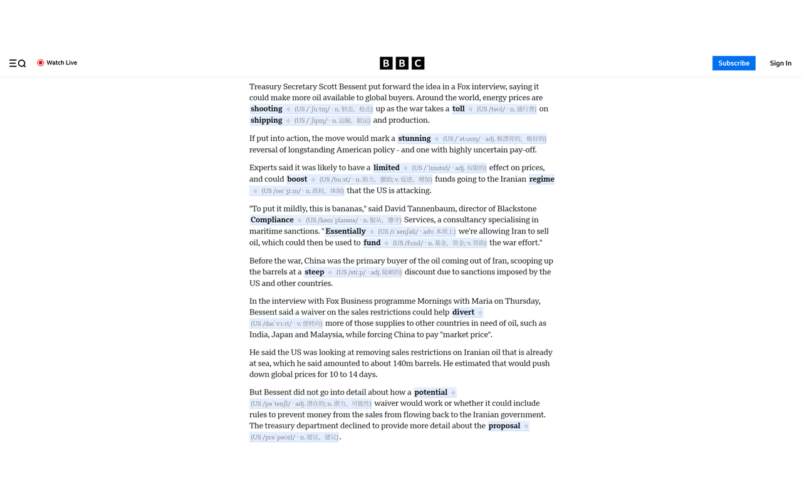
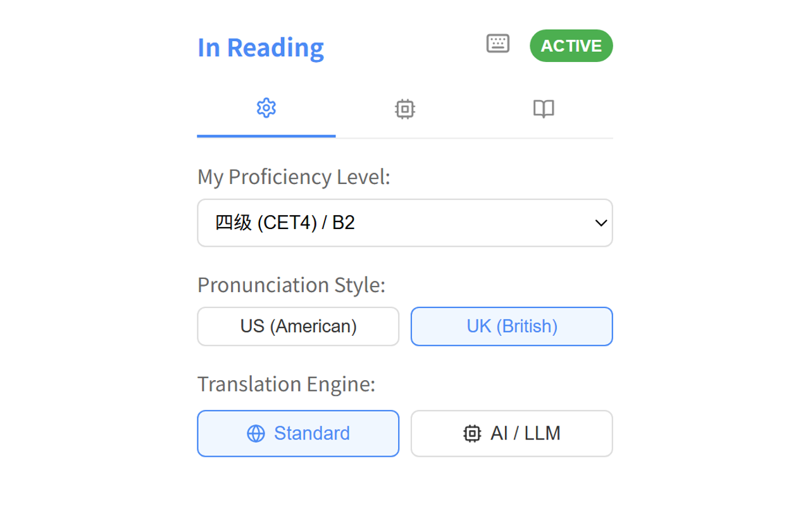
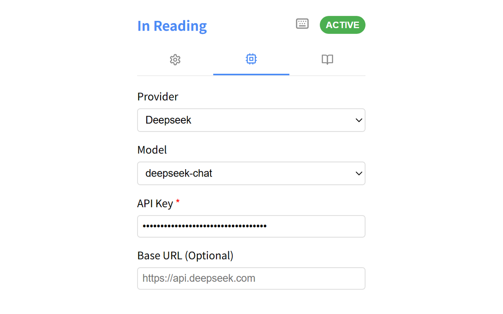
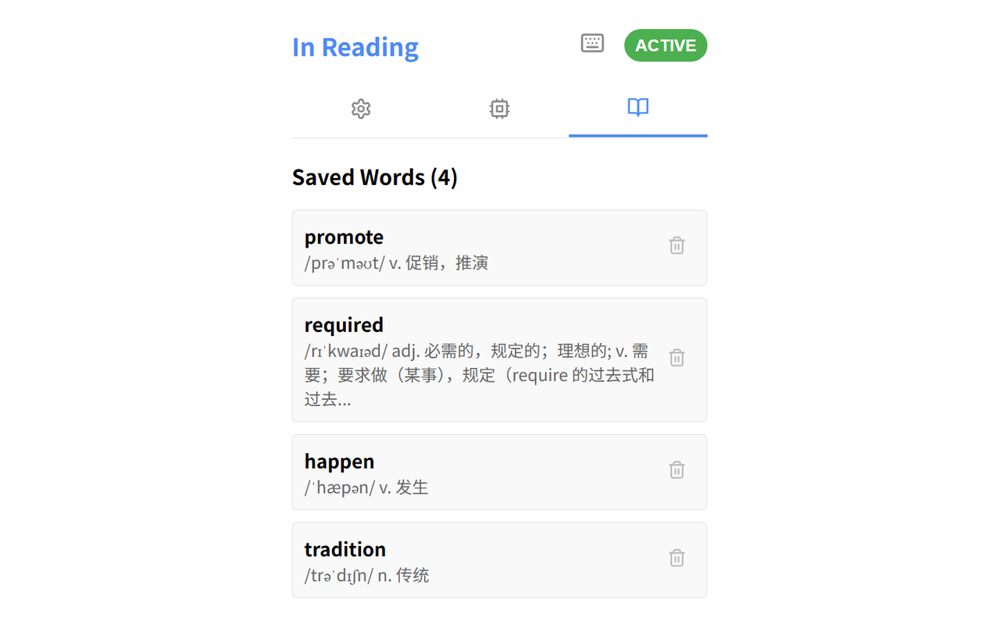
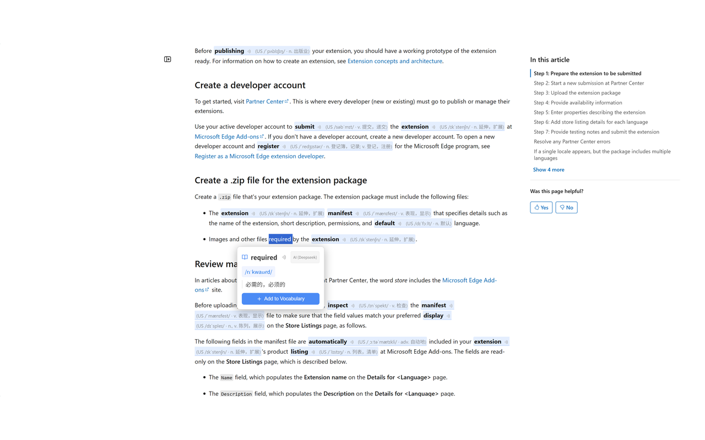

# In Reading - 英语阅读辅助插件

**In Reading** 是一款面向桌面端 Chrome 和 Edge 的英语辅助插件。它会根据使用者的英语水平，在生词旁显示 IPA 音标和简短释义，尽量减少查词对理解过程的打断。

---

## 设计思路

阅读英文内容时，常见的辅助方式各有局限：

1. **离开当前内容查词**：复制单词、切换页面、查询，再回到原来的位置，理解过程容易中断。
2. **整页翻译**：可以快速获取信息，但英文原文会被大面积中文覆盖，不适合希望继续处理英语上下文的场景。

In Reading 采用原位提示：保留英文内容，只补充当前水平下可能不熟悉的词。其设计参考了 **i + 1** 的输入理念，但不替代完整翻译工具；两者解决的是不同问题。

---

## 核心功能

### 1. 原位生词提示

IPA 音标和简短释义显示在生词旁边，不需要打开新的查询页面。

### 2. 按英语等级调整标注密度

可选择 A1-C2、CET4、CET6、考研、雅思、托福、GRE 等对应等级。插件会减少对已掌握词汇的提示，把标注集中在更难的词上。

### 3. 保护网页结构

扫描正文时会跳过标题、导航、按钮、侧边栏、代码块等非正文区域，减少注解对原网页布局的影响。

### 4. Standard 与 AI / LLM 两种模式

- **Standard**：优先使用内置本地词库，并支持有道、金山等在线词典及在线翻译回退；不需要大模型 API Key。
- **AI / LLM**：完全可选。使用时需要配置自己的 Provider、Model 和 API Key，可用于生成更多上下文相关的解释。

项目不提供开发者中转服务器，也未集成用户行为跟踪。在线词典、在线翻译和大模型请求由浏览器直接发送到对应服务。

<table align="center" border="0">
  <tr>
    <td valign="top" align="center"></td>
    <td width="20"></td>
    <td valign="top" align="center"></td>
  </tr>
</table>

---

## 其他能力

- **页面开关**：通过插件弹窗控制当前标签页，也可以在浏览器扩展快捷键页自行配置快捷键。
- **状态保持**：刷新已启用的标签页后，插件会恢复该标签页的启用状态。
- **划词与划句查询**：选中单词或句子后显示查询卡片。
- **生词本**：收藏查询到的单词，并在插件中统一查看或导出。
- **英美发音**：可以选择美式或英式 IPA 与发音。

---

## 快速上手

### 安装

普通用户有两种安装方式：

1. 在 Chrome Web Store 或 Microsoft Edge Add-ons 中搜索 `In Reading`。
2. 通过商店链接直接安装：
   - [Chrome Web Store](https://chromewebstore.google.com/detail/in-reading/ockllnfhghoinofdgaaelhfdompjgaoj?hl=en-GB)
   - [Microsoft Edge Add-ons](https://microsoftedge.microsoft.com/addons/detail/in-reading/fhbhadnohcdfcfggombmbaijgainmicj)

### 开发者本地安装

1. 克隆或下载源码。
2. 在项目目录执行 `npm install` 和 `npm run build`，构建完成后会生成 `dist` 目录。
3. 在 Chrome 的 `chrome://extensions/` 或 Edge 的 `edge://extensions/` 中开启开发者模式。
4. 点击“加载已解压的扩展程序”，选择 `dist` 目录。

### 基础设置

1. 点击浏览器工具栏里的 In Reading 图标。
2. 在 `General` 页选择英语等级、发音风格和翻译引擎。
3. 打开英文页面，通过插件弹窗开关启用或关闭当前标签页。

### 配置快捷键

快捷键需要在浏览器中自行设置，不会默认配置为 `Alt+A`。

1. 在插件弹窗右上角点击键盘图标，或者打开对应的扩展快捷键页面：
   - Chrome：`chrome://extensions/shortcuts`
   - Edge：`edge://extensions/shortcuts`
2. 找到 In Reading 的开启/关闭命令，设置一个不冲突的快捷键，例如 `Alt+A`。
3. 不配置快捷键也可以使用插件弹窗开关。

### 接入 AI / LLM（可选）

Standard 模式无需大模型 API Key。只有主动切换到 AI / LLM 模式时，才需要配置自己的服务。

1. 在插件弹窗切换到 `AI / LLM` 页，或进入扩展设置页的 `AI / LLM Configuration`。
2. 选择 Provider：Gemini、OpenAI、Claude、DeepSeek、Kimi、GLM、Qwen 或 Custom。
3. 填写 Model 和自己的 API Key。使用自定义 OpenAI 兼容端点时，还需要填写 Base URL。
4. Custom 端点需要根据浏览器提示授权访问对应地址。

### 查询与收藏

1. 启用插件后，In Reading 会按所选等级在正文中标注生词。
2. 划选单词或句子可以主动查询。
3. 在查询卡片中将单词加入生词本，之后可以统一查看或导出。

---

## 联系与反馈

问题和建议可以通过 [GitHub Issues](https://github.com/mohiria/in-reading/issues) 提交。
